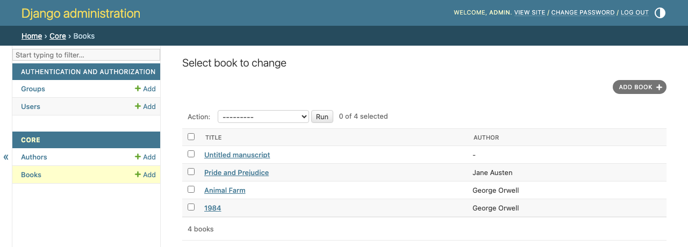
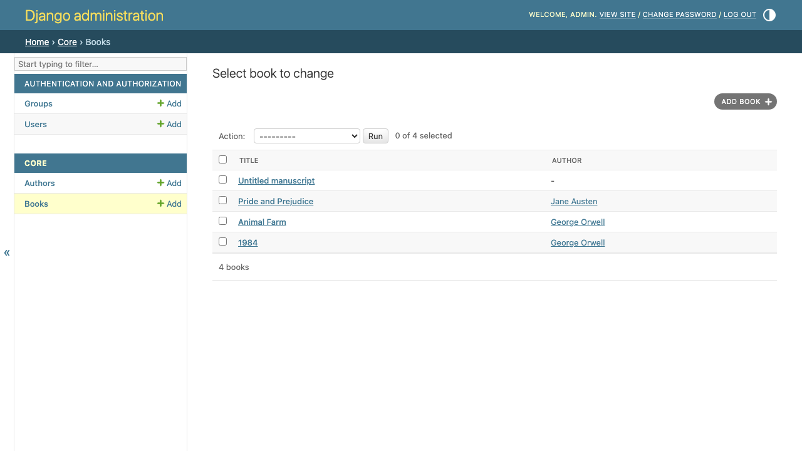

# django-admin-fk-links

[](https://github.com/rodolvbg/django-admin-fk-links/actions/workflows/pytest.yml)
[](https://pypi.org/project/django-admin-fk-links/)
[](https://pypi.org/project/django-admin-fk-links/)
[](https://pypi.org/project/django-admin-fk-links/)
[](https://pepy.tech/project/django-admin-fk-links)

Reusable Django admin mixin that turns `ForeignKey` fields into direct clickable links to their related admin change views.

---

## ✨ Features

- ✅ Converts `ForeignKey` fields into clickable links in `list_display`
- ✅ Works with the default Django admin and custom `AdminSite`
- ✅ Zero configuration
- ✅ No need to add to `INSTALLED_APPS`
- ✅ Fully compatible with Django 2.2+
<!-- - ✅ Tested with `pytest` and `pytest-django` -->

---

## 📦 Installation

```bash
pip install django-admin-fk-links
```

## 🚀 Quick Usage
```python
from django.contrib import admin
from django_admin_fk_links import ForeignKeyLinkMixin

@admin.register(Book)
class BookAdmin(ForeignKeyLinkMixin, admin.ModelAdmin):
    list_display = ("title", "author")
    list_display_foreign_key_links = ("author",)
```
That’s it.
The author column will now be a direct link to its admin change view.

---

## 🖼️ Screenshots

**Before** — `author` rendered as plain text:



**After** — `author` rendered as a clickable link to its change view:



---

## ⚙️ How It Works
The mixin dynamically replaces the fields listed in:
```python
list_display_foreign_key_links = ("field_name",)
```

with callables that render an `<a>` tag pointing to the related object’s admin change view.

It also supports:
- Sorting via admin_order_field
- Automatic verbose_name resolution
- Custom AdminSite namespaces

---
## ✅ Compatibility
- Django 2.2+
- Python 3.7+
- Default admin.site ✅
- Custom AdminSite(name="custom") ✅

---
## 🪪 License

This project is licensed under the MIT License.

---
## 🤝 Contributing

Contributions, issues and feature requests are welcome.
Feel free to open a PR or issue.

## ⭐ If you find it useful

Please consider giving the project a ⭐ on GitHub — it really helps!
