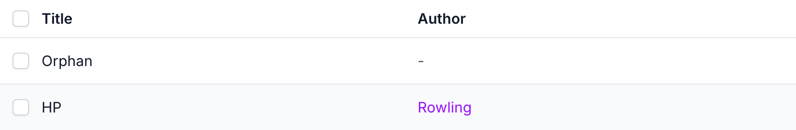
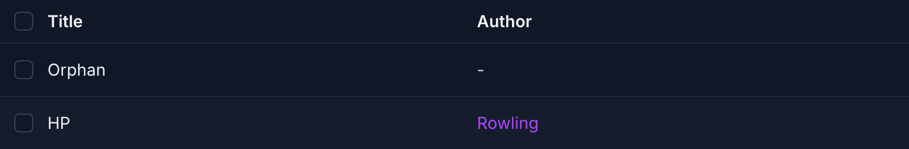

# django-admin-fk-links with django-unfold

## Usage

Works with [django-unfold](https://unfoldadmin.com/)'s `ModelAdmin` as it
is. Unfold's reset styles links like the text around them, so when `unfold`
is in `INSTALLED_APPS` the links get its link colors
(`text-primary-600 dark:text-primary-500`, light and dark); set
`foreign_key_link_class` to use other classes, or `""` for none. Tested with
django-unfold 0.108.

## Screenshots

In dark mode:

